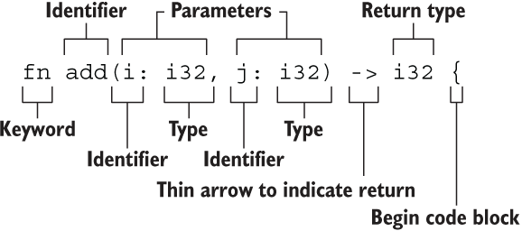

# 函数

大概声明方式如下：



- 蛇形命名：`fn add_two() -> {}`
- 如果不写返回值，则默认是`()`
- 实际例子

```rust
fn plus_or_minus(x:i32) -> i32 {
    if x > 5 {
        return x - 5
    }

    x + 5 // 表达式作为返回值，没有分号
}

fn main() {
    let x = plus_or_minus(5);

    println!("The value of x is: {}", x);
}
```

- 永不返回的发散函数：

当用 `!` 作函数返回类型的时候，表示该函数永不返回( diverge function )，特别的，这种语法往往用做会导致程序崩溃的函数：

```rust
fn dead_end() -> ! {
  panic!("你已经到了穷途末路，崩溃吧！");
}
```

下面的函数创建了一个无限循环，该循环永不跳出，因此函数也永不返回：

```rust
fn forever() -> ! {
  loop {
    //...
  };
}
```


