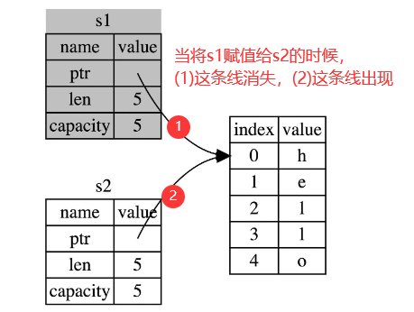

# 所有权

## 预热

管理内存的三大方式：

- 垃圾回收机制(GC)，在程序运行时不断寻找不再使用的内存，典型代表：Java、Go
- 手动管理内存的分配和释放,，在程序中，通过函数调用的方式来申请和释放内存，典型代表：C++
- 通过所有权来管理内存，编译器在编译时会根据一系列规则进行检查，典型代表：Rust

## 堆栈

### stack

- 后进先出
- 存放对于大小已知的数据

### heap

- 存放对于大小未知或者可能变化的数据
- 当向堆上放入数据时，需要请求一定大小的内存空间。操作系统在堆的某处找到一块足够大的空位，把它标记为已使用，并返回一个表示该位置地址的指针, 该过程被称为在堆上分配内存，有时简称为 “分配”(allocating)。接着，该指针会被推入栈中，因为指针的大小是已知且固定的，在后续使用过程中，你将通过栈中的指针，来获取数据在堆上的实际内存位置，进而访问该数据。

联系：当调用一个函数时，传递给函数的参数（包括可能指向堆上数据的指针、函数的局部变量）会被依次压入栈中，当函数调用结束时，这些值将被从栈中按照相反的顺序依次移除。

## 所有权

> 所有权的核心规则如下：
>
> - Rust 中每一个值都被一个变量所拥有，该变量被称为值的所有者
> - 一个值同时只能被一个变量所拥有，或者说一个值只能拥有一个所有者
> - 当所有者(变量)离开作用域范围时，这个值将被丢弃(drop)

### 转移所有权

例子1：下面代码没有发生所有权的转移： 整数是 Rust 基本数据类型，是固定大小的简单值，因此这两个值都是通过自动拷贝的方式来赋值的，都被存在栈中。

```rust
let x = 5;
let y = x;
```

例子2：下面代码发生所有权的转移： String 类型由存储在栈中的堆指针、字符串长度、字符串容量共同组成。当 `s1` 被赋予 给`s2` 后， `s1` 不再有效，所有权从 `s1` 转移给了 `s2`，`s1` 在被赋予 `s2` 后就马上失效了。

```rust
let s1 = String::from("hello");
let s2 = s1;
// 如果后面继续使用s1，则报错。比如你println一下看看
```



例子3：`x` 只是引用了存储在二进制可执行文件中的字符串 `"hello, world"`，并没有持有所有权。 `let y = x` 仅仅是对该引用进行了拷贝，此时 `y` 和 `x` 都引用了同一个字符串。

```rust
let x: &str = "hello, world";
let y = x;
println!("{},{}",x,y);
```

### 深拷贝

Rust不会自动地对数据进行深拷贝。深拷贝在堆上复制了一份给你

> 如果想要深拷贝，使用`.clone()`，消耗的内存会多一些

### 浅拷贝

任何基本类型的组合可以浅拷贝，不需要分配内存或某种形式资源是可以浅拷贝的。浅拷贝之后，被拷贝的东西还可以再使用

> 浅拷贝的本质是实现了Copy这个trait
>
> 不可变引用&T也是浅拷贝

## 函数传值与返回

将值传递给函数，一样会发生 `移动` 或者 `复制`，就跟 `let` 语句一样，下面的代码展示了所有权、作用域的规则：

```rust
fn main() {
    let s = String::from("hello, I am LEVI_104");
    takes_ownership(s); // s 的值移动到函数里，所以到这里不再有效，你试试println一下s，会报错
    
    let x = 5; 
    makes_copy(x);
	println!("{}", x); // x 应该移动函数里，但 i32 是 Copy 的，所以在后面可继续使用 x
    
   let g = gives_ownership();
    println!("{}", g); // 所有权从gives_ownership => g => println
}

fn takes_ownership(s: String) {
    println!("{}", s);
}

fn makes_copy(c: i32) {
    println!("{}", c);
}

fn gives_ownership() -> String{
    String::from("give u a String")
}
```


