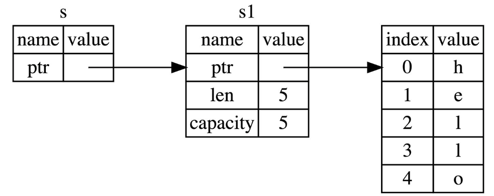

# 引用&借用

## 引用&解引用

```rust
let x = 5;
let y = &x;

assert_eq!(5, x);
assert_eq!(5, *y);
```

## 不可变引用

```rust
fn main() { 
    let s1 = String::from("hello, I am LEVI_104");

    let len = calculate_length(&s1);

    println!("The length of '{}' is {}.", s1, len);
}

fn calculate_length(s: &String) -> usize { // 传递引用给函数
    s.len()
}
```

例子中的指针指向情况你可以这么理解：s指向了s1：



## 可变引用

### 简单示例

```rust
fn main() {
    let mut s = String::from("hello");
    let test = String::from("test");
    change(&mut s);
    println!("{}", s);
    println!("{}", s);
    println!("{}", test);
    println!("{}", test);
}

fn change(stuff: &mut String) {
    stuff.push_str(",LEVI_104")
}
```

### 同一作用域，唯一可变引用

同一作用域，特定数据只能有一个可变引用。下面的代码会报错：

```rust
let mut s = String::from("hello");

let r1 = &mut s; // 解决方法是加上花括号 {let r1 = &mut s;}，作用域结束之后，r1的引用就消失了
let r2 = &mut s; 

println!("{}, {}", r1, r2);
```

> 可以理解为，如果两个上面的引用，会发生数据竞争。数据竞争在如下情况同时存在时发生：
>
> - 两个或更多的指针同时访问同一数据
> - 至少有一个指针被用来写入数据
> - 没有同步数据访问的机制

### 可变&不可变，不同时存在

```rust
let mut s = String::from("hello");

let r1 = &s; // 没问题
let r2 = &s; // 没问题
let r3 = &mut s; // 大问题

println!("{}, {}, and {}", r1, r2, r3);
```

> 注意，引用的作用域 `s` 从创建开始，一直持续到它最后一次使用的地方，这个跟变量的作用域有所不同，变量的作用域从创建持续到某一个花括号 `}`

来对比一下新旧编译器的判断：如果旧版本编译器，下面的代码报错(原因是r1,r2在`}`才结束生命，同时存在了可变和不可变引用)，新版本的编译器不会报错

```rust
fn main() {
   let mut s = String::from("hello");

    let r1 = &s;
    let r2 = &s;
    println!("{} and {}", r1, r2);
    // 新编译器中，r1,r2作用域在这里结束

    let r3 = &mut s;
    println!("{}", r3);
} // 老编译器中，r1、r2、r3作用域在这里结束
  // 新编译器中，r3作用域在这里结束
```

## 悬垂引用

定义：指针指向某个值后，这个值被释放掉了，而指针仍然存在，其指向的内存可能不存在任何值或已被其它变量重新使用。下面搞一个看看咋回事：

```rust
fn main() {
    let reference_to_nothing = dangle();
}

fn dangle() -> &String {
    let s = String::from("hello");

    &s // 修复： &s => s
} // 这里s的生命周期结束，没有传递出去其所有权。但传递出去了一个指针，报错了
```


