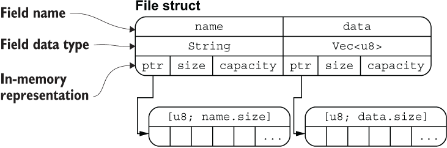

# 结构体

## 语法

定义：

```rust
struct User {
    active: bool,
    username: String,
    email: String,
    sign_in_count: u64,
}
```

创建实例：每个字段都要初始化；字段顺序可以变化

```rust
    let user1 = User { 
        email: String::from("someone@example.com"),
        username: String::from("someusername123"),
        active: true,
        sign_in_count: 1,
    };
```

访问结构体字段：

```rust
let mut user1 = User {
    email: String::from("someone@example.com"),
    username: String::from("someusername123"),
    active: true,
    sign_in_count: 1,
};

user1.email = String::from("anotheremail@example.com");
```

函数创建结构体：

```rust
fn new_user(email: String, username: String) -> User {
    User {
        email: email,
        username: username,
        active: true,
        sign_in_count: 1,
    }
    // 或者使用语法糖
    // User {
    //    email,
    //    username,
    //    active: true,
    //    sign_in_count: 1,
    //}
}
```

结构体更新：根据已有的 `user1` 实例来构建 `user2`：

```rust
let user2 = User {
    active: user1.active,
    username: user1.username,
    email: String::from("another@example.com"),
    sign_in_count: user1.sign_in_count,
};
// 或者使用语法糖: .. 语法表明凡是我们没有显式声明的字段，全部从 user1 中自动获取。需要注意的是 ..user1 必须在结构体的尾部使用。
//let user2 = User {
//    email: String::from("another@example.com"),
//    ..user1
//};
```

> 更新之后的user1的所有权丧失，因为user1的username字段的所有权给了user2，但其他字段的所有权保留。
>
> 因此：`println!("{}", user1.active); `合法，但是`println!("{:?}", user1);`会报错

## 内存排列

```rust
#[derive(Debug)]
struct File {
    name: String,
    data: Vec<u8>
}

fn main() {
    let f1 = File{
        name: String::from("Hi, I am LEVI_104"),
        data: Vec::new(),
    };
    let f1_name = &f1.name;
    let f1_length = &f1.data.len();

    println!("{:?}", f1);
    println!("{} is {} bytes long", f1_name, f1_length);
}
```

其内存排布情况如下：



> 这也从侧面证明：把结构体中具有所有权的字段转移出去后，将无法再访问该字段，但是可以正常访问其它的字段。

## 元组结构体

Tuple Struct：

```rust
struct Color(i32, i32, i32);
struct Point(i32, i32, i32);

let black = Color(0, 0, 0);
let origin = Point(0, 0, 0);
```

## 单元结构体

Unit-like Struct：如果你定义一个类型，但是不关心该类型的内容, 只关心它的行为时，就可以使用 `单元结构体`

```rust
struct AlwaysEqual;

let subject = AlwaysEqual;

// 我们不关心 AlwaysEqual 的字段数据，只关心它的行为，因此将它声明为单元结构体，然后再为它实现某个特征
impl SomeTrait for AlwaysEqual {

}
```

## 结构体数据的所有权

先不考虑复杂的生命周期，暂且认为：如果你想在结构体中使用一个引用，就必须加上生命周期，否则就会报错

```rust
struct User {
    username: &str,
    email: &str,
    sign_in_count: u64,
    active: bool,
}

fn main() { // 这里的代码会报错，因为没有加上生命周期
    let user1 = User {
        email: "someone@example.com",
        username: "someusername123",
        active: true,
        sign_in_count: 1,
    };
}
```

## \#[derive(Debug)]

如果我们使用 `{}` 来格式化输出，那对应的类型就必须实现 `Display` trait。但是Rust没有帮结构体实现默认的`Display`，但我们可以在结构体上面增加`#[derive(Debug)]`来辅助输出结构体（其派生实现了`Debug`trait）：

```rust
#[derive(Debug)] 
struct Rectangle {
    width: u32,
    height: u32,
}

fn main() {
    let rect1 = Rectangle {
        width: 30,
        height: 50,
    };

    println!("rect1 is {:?}", rect1);
}
```

3种格式化输出：

- `{:?}`：

```
rect1 is Rectangle { width: 30, height: 50 }
```

- `{:#?}`：

```
rect1 is Rectangle {
    width: 30,
    height: 50,
}
```

- `dbg!`：还有一种debug信息方式：它会拿走表达式的所有权，然后打印出相应的文件名、行号等 debug 信息，最终还会把表达式值的所有权返回

```rust
#[derive(Debug)]
struct Rectangle {
    width: u32,
    height: u32,
}

fn main() {
    let scale = 2;
    let rect1 = Rectangle {
        width: dbg!(30 * scale),
        height: 50,
    };

    dbg!(&rect1);
}
//[src\main.rs:28] 30 * scale = 60
// [src\main.rs:32] &rect1 = Rectangle {
//     width: 60,
//     height: 50,
// }
```


