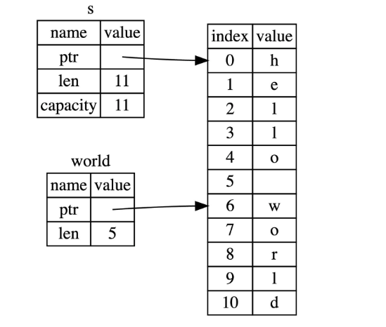

# 字符串&切片

## 切片

例子1：切片快速入门

```rust
let s = String::from("hello world");

let hello: &str = &s[0..5];
let world = &s[6..11];
// 切片的选取方式跟其他语言一样，就不做演示了，不会就Google或者问AI，不罗嗦了
```

注意capacity，好好理解一下所有权和指针



例子2：在对字符串使用切片语法时需要格外小心，切片的索引必须落在字符之间的边界位置，也就是 UTF-8 字符的边界，例如中文在 UTF-8 中占用三个字节，下面的代码就会崩溃：

```rust
 let s = "中国人";
 let a = &s[0..2];
 println!("{}",a);
```

因为我们只取 `s` 字符串的前两个字节，但是本例中每个汉字占用三个字节，因此没有落在边界处，也就是连 `中` 字都取不完整，此时程序会直接崩溃退出，如果改成 `&s[0..3]`，则可以正常通过编译。

例子3：其他类型的切片比如数组切片

```solidity
let a = [1, 2, 3, 4, 5];

let slice = &a[1..3];

assert_eq!(slice, &[2, 3]);
```

例子4：字符串字面量也是切片

```rust
let s: &str = "Hello, world!";
```

## 字符串

### 介绍

特点：

- Rust 中的字符是 Unicode 类型，因此每个字符占据 4 个字节内存空间

- 字符串是 UTF-8 编码，也就是字符串中的字符所占的字节数是变化的(1 - 4)，这样有助于大幅降低字符串所占用的内存空间。
- String和&str都是UTF-8

字符串索引：不允许

- 字符串的底层的数据存储格式实际上是[ u8 ]，一个字节数组
- 不同语言的编码方式不同（比如一个字符1byte，一个中文3bytes），强行用字符串索引会割裂字符串，可能产生未知的结果

举个例子：

```rust
let s1 = String::from("hello");
let h = s1[0];
```

字符串切片：可以用，但你得格外小心

```rust
let hello = "中国人";
let s = &hello[0..2]; // 报错，因为一个中文占3bytes，修改成let s = &hello[0..3];
```

### 使用

- 追加(Push)：在字符串尾部可以使用 `push()` 方法追加字符 char，也可以使用 `push_str()` 方法追加字符串字面量。这两个方法都是在原有的字符串上追加，并不会返回新的字符串。由于字符串追加操作要修改原来的字符串，则该字符串必须是可变的

```rust
fn main() {
    let mut s = String::from("Hello ");

    s.push_str("rust");
    println!("追加字符串 push_str() -> {}", s);

    s.push('!');
    println!("追加字符 push() -> {}", s);
}
```

- 插入(Insert)：可以使用 `insert()` 方法插入单个字符 `char`，也可以使用 `insert_str()` 方法插入字符串字面量。由于字符串插入操作要修改原来的字符串，则该字符串必须是可变的

```rust
fn main() {
    let mut s = String::from("Hello rust!");
    s.insert(5, ',');
    println!("插入字符 insert() -> {}", s);
    s.insert_str(6, " I like");
    println!("插入字符串 insert_str() -> {}", s);
}
```

- 替换(Replace)：replace(), replacen(), replace_range()

```rust
// 该方法是返回一个新的字符串，而不是操作原来的字符串。
let string_replace = String::from("I like rust. Learning rust is my favorite!");
let new_string_replace = string_replace.replace("rust", "RUST");
dbg!(new_string_replace);

// 该方法是返回一个新的字符串，而不是操作原来的字符串。
let string_replace = "I like rust. Learning rust is my favorite!";
let new_string_replacen = string_replace.replacen("rust", "RUST", 1);
dbg!(new_string_replacen);

// 该方法是直接操作原来的字符串，不会返回新的字符串。该方法需要使用 mut 关键字修饰。
let mut string_replace_range = String::from("I like rust!");
string_replace_range.replace_range(7..8, "R");
dbg!(string_replace_range);
```

- 删除(Delete)：
  - pop()：
    - 删除并返回字符串的最后一个字符。
    - 该方法是直接操作原来的字符串。
    - 其返回值是一个 Option 类型，如果字符串为空，则返回 None。
  - remove()：
    - 该方法是直接操作原来的字符串
    - 按照字节来处理字符串的，如果参数所给的位置不是合法的字符边界，则会发生错误。
  - truncate()：
    - 删除字符串中从指定位置开始到结尾的全部字符
    - 该方法是直接操作原来的字符串。无返回值。
    - 按照字节来处理字符串的，如果参数所给的位置不是合法的字符边界，则会发生错误。
  - clear()：
    - 清空字符串
    - 该方法是直接操作原来的字符串。调用后，删除字符串中的所有字符

- 连接(Concatenate)
  - 使用 `+` 或者 `+=` 连接字符串：
    - 右边的参数必须为字符串的切片引用（Slice）类型。
    - 其实当调用 `+` 的操作符时，相当于调用了 `std::string` 标准库中的 [`add()`](https://doc.rust-lang.org/std/string/struct.String.html#method.add) 方法，这里 `add()` 方法的第二个参数是一个引用的类型。因此我们在使用 `+` 时， 必须传递切片引用类型。
    - 不能直接传递 `String` 类型。`+` 是返回一个新的字符串，所以变量声明可以不需要 `mut` 关键字修饰。
  - 使用 `format!` 连接字符串：
    - 适用于 `String` 和 `&str`

### 转义

转义

```rust
fn main() {
    // 通过 \ + 字符的十六进制表示，转义输出一个字符
    let byte_escape = "I'm writing \x52\x75\x73\x74!";
    println!("What are you doing\x3F (\\x3F means ?) {}", byte_escape);

    // \u 可以输出一个 unicode 字符
    let unicode_codepoint = "\u{211D}";
    let character_name = "\"DOUBLE-STRUCK CAPITAL R\"";

    println!(
        "Unicode character {} (U+211D) is called {}",
        unicode_codepoint, character_name
    );

    // 换行了也会保持之前的字符串格式
    // 使用\忽略换行符
    let long_string = "String literals
                        can span multiple lines.
                        The linebreak and indentation here ->\
                        <- can be escaped too!";
    println!("{}", long_string);
}
```

不转义

```rust
fn main() {
    println!("{}", "hello \\x52\\x75\\x73\\x74");
    let raw_str = r"Escapes don't work here: \x3F \u{211D}";
    println!("{}", raw_str);

    // 如果字符串包含双引号，可以在开头和结尾加 #
    let quotes = r#"And then I said: "There is no escape!""#;
    println!("{}", quotes);

    // 如果还是有歧义，可以继续增加，没有限制
    let longer_delimiter = r###"A string with "# in it. And even "##!"###;
    println!("{}", longer_delimiter);
}
```

### 操作UTF-8字符串

字符：以 Unicode 字符的方式遍历字符串，最好的办法是使用 `chars` 方法

```rust
for c in "中国人".chars() {
    println!("{}", c);
}
```

字节：这种方式是返回字符串的底层字节数组表现形式：

```rust
for b in "中国人".bytes() {
    println!("{}", b);
}
```


