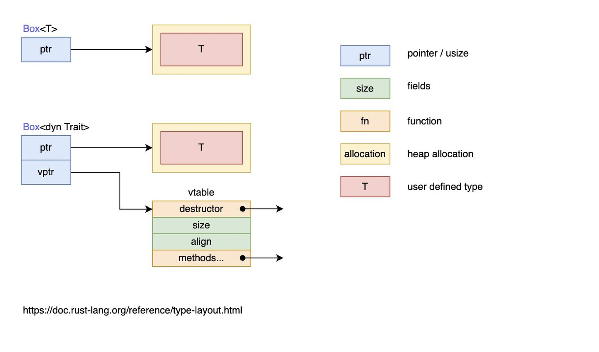

# trait对象

## 目前存在的问题

下面的代码会报错，因为函数试图通过返回 `impl Summary` 来返回这两个类型，`impl Trait` 的返回值类型并不支持多种不同的类型返回

```rust
fn returns_summarizable(switch: bool) -> impl Summary {
    if switch {
        Post {
           // ...
        }
    } else {
        Weibo {
            // ...
        }
    }
}
```

## 使用方式

### 什么是trait对象

可以通过 `&` 引用或者 `Box<T>` 智能指针的方式来创建trait对象。我们需要理解下面的内容：

- `draw1` 函数的参数是 `Box<dyn Draw>` 形式的trait对象，该trait对象是通过 `Box::new(x)` 的方式创建的
- `draw2` 函数的参数是 `&dyn Draw` 形式的trait对象，该trait对象是通过 `&x` 的方式创建的
- `dyn` 关键字只用在trait对象的类型声明上，在创建时无需使用 `dyn`

```rust
trait Draw {
    fn draw(&self) -> String;
}

impl Draw for u8 {
    fn draw(&self) -> String {
        format!("u8: {}", *self)
    }
}

impl Draw for f64 {
    fn draw(&self) -> String {
        format!("f64: {}", *self)
    }
}

// 若 T 实现了 Draw 特征， 则调用该函数时传入的 Box<T> 可以被隐式转换成函数参数签名中的 Box<dyn Draw>
fn draw1(x: Box<dyn Draw>) {
    // 由于实现了 Deref 特征，Box 智能指针会自动解引用为它所包裹的值，然后调用该值对应的类型上定义的 `draw` 方法
    x.draw();
}

fn draw2(x: &dyn Draw) {
    x.draw();
}

fn main() {
    let x = 1.1f64;
    // do_something(&x);
    let y = 8u8;

    // x 和 y 的类型 T 都实现了 `Draw` 特征，因为 Box<T> 可以在函数调用时隐式地被转换为特征对象 Box<dyn Draw> 
    // 基于 x 的值创建一个 Box<f64> 类型的智能指针，指针指向的数据被放置在了堆上
    draw1(Box::new(x));
    // 基于 y 的值创建一个 Box<u8> 类型的智能指针
    draw1(Box::new(y));
    draw2(&x);
    draw2(&y);
}
```

现在，我们知道了：可以使用trait对象来代表泛型或具体的类型。

### trait对象例子

```rust
pub trait Draw {
    fn draw(&self);
}

pub struct Button {
    pub width: u32,
    pub height: u32,
    pub label: String,
}

impl Draw for Button {
    fn draw(&self) {
        // 绘制按钮的代码
        println!("Button draw");
    }
}

struct SelectBox {
    width: u32,
    height: u32,
    options: Vec<String>,
}

impl Draw for SelectBox {
    fn draw(&self) {
        // 绘制SelectBox的代码
        println!("SelectBox draw")
    }
}


pub struct Screen {
    // 任何实现了Draw 这个trait的东西，都可以放进去
    pub components: Vec<Box<dyn Draw>>, // trait 对象
}

impl Screen {
    pub fn run(&self) {
        for component in self.components.iter() {
            component.draw();
        }
    }
}

fn main() {
    let screen = Screen {
        components: vec![
            Box::new(SelectBox {
                width: 75,
                height: 10,
                options: vec![
                    String::from("Yes"),
                    String::from("Maybe"),
                    String::from("No")
                ],
            }),
            Box::new(Button {
                width: 50,
                height: 10,
                label: String::from("OK"),
            }),
        ],
    };

    screen.run();
}
```

## 静态-动态分发

泛型是在编译期完成处理的：编译器会为每一个泛型参数对应的具体类型生成一份代码，这种方式是**静态分发(static dispatch)**，因为是在编译期完成的，对于运行期性能完全没有任何影响。

与静态分发相对应的是**动态分发(dynamic dispatch)**，在这种情况下，直到运行时，才能确定需要调用什么方法。之前代码中的关键字 `dyn` 正是在强调这一“动态”的特点。

当使用trait对象时，Rust 必须使用动态分发。编译器无法知晓所有可能用于trait对象代码的类型，所以它也不知道应该调用哪个类型的哪个方法实现。为此，Rust 在运行时使用trait对象中的指针来知晓需要调用哪个方法。动态分发也阻止编译器有选择的内联方法代码，这会相应的禁用一些优化。

下面这张图很好的解释了静态分发 `Box<T>` 和动态分发 `Box<dyn Trait>` 的区别：



结合上文的内容和这张图可以了解：

- **trait对象大小不固定**：这是因为，对于 `Draw`这个trait，类型 `Button` 可以实现 `Draw`，类型 `SelectBox` 也可以实现 `Draw`，因此trait没有固定大小

- **几乎总是使用trait对象的引用方式**，如 `&dyn Draw`、`Box<dyn Draw>`
  - 虽然trait对象没有固定大小，但它的引用类型的大小是固定的，它由两个指针组成（`ptr` 和 `vptr`），因此占用两个指针大小
  - 一个指针 `ptr` 指向实现了 `Draw` 的具体类型的实例，也就是当作 `Draw` 来用的类型的实例，比如类型 `Button` 的实例、类型 `SelectBox` 的实例
  - 另一个指针 `vptr` 指向一个虚表 `vtable`，`vtable` 中保存了类型 `Button` 或类型 `SelectBox` 的实例对于可以调用的实现于 `Draw` 的方法。当调用方法时，直接从 `vtable` 中找到方法并调用。之所以要使用一个 `vtable` 来保存各实例的方法，是因为实现了 `Draw` 的类型有多种，这些类型拥有的方法各不相同，当将这些类型的实例都当作特`Draw` 来使用时(此时，它们全都看作是 `Draw` 类型的实例)，有必要区分这些实例各自有哪些方法可调用

简而言之，当类型 `Button` 实现了 `Draw` 时，类型 `Button` 的实例对象 `btn` 可以当作 `Draw` 的trait对象类型来使用，`btn` 中保存了作为trait对象的数据指针（指向类型 `Button` 的实例数据）和行为指针（指向 `vtable`）。

一定要注意，此时的 `btn` 是 `Draw` 的trait对象的实例，而不再是具体类型 `Button` 的实例，而且 `btn` 的 `vtable` 只包含了实现自 `Draw` 的那些方法（比如 `draw`），因此 `btn` 只能调用实现于特`Draw` 的 `draw` 方法，而不能调用类型 `Button` 本身实现的方法和类型 `Button` 实现于其他trait的方法。**也就是说，`btn` 是哪个trait对象的实例，它的 `vtable` 中就包含了该trait的方法。**

## Self和self

在 Rust 中，有两个`self`，一个指代当前的实例对象，一个指代trait或者方法类型的别名：

```rust
trait Draw {
    fn draw(&self) -> Self;
}

#[derive(Clone)]
struct Button;
impl Draw for Button {
    // self指代的就是当前的实例对象
    fn draw(&self) -> Self { // Self 则指代的是 Button 类型
        return self.clone()
    }
}

fn main() {
    let button = Button;
    let newb = button.draw();
}
```

## 限制

不是所有trait都能拥有trait对象，只有对象安全的特征才行。当一个trait的所有方法都有如下属性时，它的对象才是安全的：

- 方法的返回类型不能是 `Self`
- 方法没有任何泛型参数

对象安全对于特征对象是必须的，因为一旦有了trait对象，就不再需要知道实现该特征的具体类型是什么了。

如果trait方法返回了具体的 `Self` 类型，但是trait对象忘记了其真正的类型，那这个 `Self` 就非常尴尬，因为没人知道它是谁了。由于泛型是静态分发，也会返回具体的类型，因此也不能这么做。

具体举个例子：标准库中的 `Clone`

```rust
pub trait Clone {
    fn clone(&self) -> Self;
}
```

因此下面会报错：

```rust
pub struct Screen {
    pub components: Vec<Box<dyn Clone>>,
}
```


