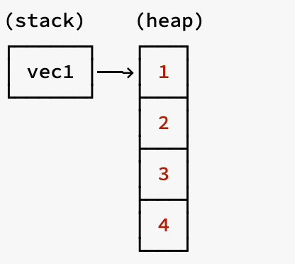
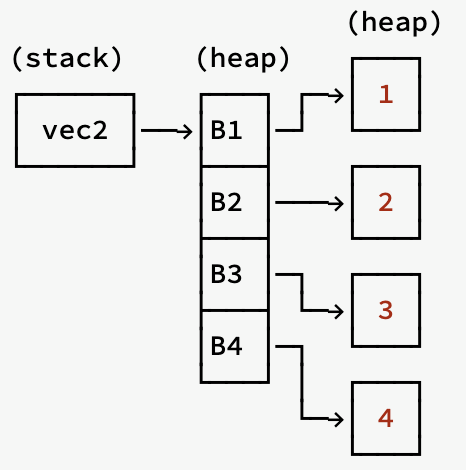

# 堆对象分配

## Rust中的堆栈

Rust中，`main`线程堆栈大小是8MB，普通线程是2MB。

性能：

- 小型数据，在栈上的分配性能和读取性能都要比堆上高
- 中型数据，栈上分配性能高，但是读取性能和堆上并无区别，因为无法利用寄存器或 CPU 高速缓存，最终还是要经过一次内存寻址
- 大型数据，只建议在堆上分配和使用

## Box的使用场景

由于 `Box` 是简单的封装，除了将值存储在堆上外，并没有其它性能上的损耗。 `Box` 相比其它智能指针，功能较为单一，可以在以下场景中使用它：

- 特意的将数据分配在堆上
- 数据较大时，又不想在转移所有权时进行数据拷贝
- 类型的大小在编译期无法确定，但是我们又需要固定大小的类型时
- trait对象，用于说明对象实现了一个特征，而不是某个特定的类型

例子1：避免栈上数据的拷贝

```rust
fn main() {
    // 在栈上创建一个长度为1000的数组
    let arr = [0;1000];
    // 将arr所有权转移arr1，由于 `arr` 分配在栈上，因此这里实际上是直接重新深拷贝了一份数据
    let arr1 = arr;

    // arr 和 arr1 都拥有各自的栈上数组，因此不会报错
    println!("{:?}", arr.len());
    println!("{:?}", arr1.len());

    // 在堆上创建一个长度为1000的数组，然后使用一个智能指针指向它
    let arr = Box::new([0;1000]);
    // 将堆上数组的所有权转移给 arr1，由于数据在堆上，因此仅仅拷贝了智能指针的结构体，底层数据并没有被拷贝
    // 所有权顺利转移给 arr1，arr 不再拥有所有权
    let arr1 = arr;
    println!("{:?}", arr1.len());
    // 由于 arr 不再拥有底层数组的所有权，因此下面代码将报错
    // println!("{:?}", arr.len());
}
```

例子2：将动态大小类型变为 Sized 固定大小类型

```rust
enum List {
    Cons(i32, List), // 报错
    Nil,
}

enum List {
    Cons(i32, Box<List>), // 正确
    Nil,
}
```

例子3：trait对象

```rust
trait Draw {
    fn draw(&self);
}

struct Button {
    id: u32,
}
impl Draw for Button {
    fn draw(&self) {
        println!("这是屏幕上第{}号按钮", self.id)
    }
}

struct Select {
    id: u32,
}

impl Draw for Select {
    fn draw(&self) {
        println!("这个选择框贼难用{}", self.id)
    }
}

fn main() {
    let elems: Vec<Box<dyn Draw>> = vec![Box::new(Button { id: 1 }), Box::new(Select { id: 2 })];

    for e in elems {
        e.draw()
    }
}
```

## Box内存布局

例子1：`Vec<i32>`的内存布局：


例子2：`Vec<Box<i32>>`的内存布局

```rust
fn main() {
    let arr = vec![Box::new(1), Box::new(2)];
    let (first, second) = (&arr[0], &arr[1]);
    let sum = **first + **second;
}
```



## Box::leak 

`Box::leak`可以消费掉 `Box` 并且强制目标值从内存中泄漏。

在之前的代码中，如果 `String` 创建于函数中，那么返回它的唯一方法就是转移所有权给调用者 `fn move_str() -> String`，而通过 `Box::leak` 我们不仅返回了一个 `&str` 字符串切片，它还是 `'static` 生命周期的！

要知道真正具有 `'static` 生命周期的往往都是编译期就创建的值，例如 `let v = "hello, world"`，这里 `v` 是直接打包到二进制可执行文件中的，因此该字符串具有 `'static` 生命周期，再比如 `const` 常量。

又有读者要问了，我还可以手动为变量标注 `'static` 啊。其实你标注的 `'static` 只是用来忽悠编译器的，但是超出作用域，一样被释放回收。而使用 `Box::leak` 就可以将一个运行期的值转为 `'static`。

```rust
fn main() {
   let s = gen_static_str();
   println!("{}", s);
}

fn gen_static_str() -> &'static str{
    let mut s = String::new();
    s.push_str("hello, world");
		// 例如，你可以把一个 String 类型，变成一个 'static 生
    // 命周期的 &str 类型
    Box::leak(s.into_boxed_str())
}
```

使用场景：**你需要一个在运行期初始化的值，但是可以全局有效，也就是和整个程序活得一样久**，那么就可以使用 `Box::leak`，例如有一个存储配置的结构体实例，它是在运行期动态插入内容，那么就可以将其转为全局有效，虽然 `Rc/Arc` 也可以实现此功能，但是 `Box::leak` 是性能最高的


