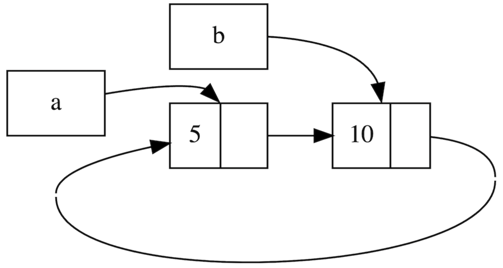

# Weak与循环引用

## 循环引用

```rust
fn main() {
    let a = Rc::new(Cons(5, RefCell::new(Rc::new(Nil))));

    println!("a的初始化rc计数 = {}", Rc::strong_count(&a));
    println!("a指向的节点 = {:?}", a.tail());

    // 创建`b`到`a`的引用
    let b = Rc::new(Cons(10, RefCell::new(Rc::clone(&a))));

    println!("在b创建后，a的rc计数 = {}", Rc::strong_count(&a));
    println!("b的初始化rc计数 = {}", Rc::strong_count(&b));
    println!("b指向的节点 = {:?}", b.tail());

    // 利用RefCell的可变性，创建了`a`到`b`的引用
    if let Some(link) = a.tail() {
        *link.borrow_mut() = Rc::clone(&b);
    }

    println!("在更改a后，b的rc计数 = {}", Rc::strong_count(&b));
    println!("在更改a后，a的rc计数 = {}", Rc::strong_count(&a));

    // 下面一行println!将导致循环引用
    // 我们可怜的8MB大小的main线程栈空间将被它冲垮，最终造成栈溢出
    // println!("a next item = {:?}", a.tail());
}
```

1. 在创建了 `a` 后，紧接着就使用 `a` 创建了 `b`，因此 `b` 引用了 `a`
2. 然后我们又利用 `Rc` 克隆了 `b`，然后通过 `RefCell` 的可变性，让 `a` 引用了 `b`

至此我们成功创建了循环引用`a`-> `b` -> `a` -> `b` ····

先来观察下引用计数：

```console
a的初始化rc计数 = 1
a指向的节点 = Some(RefCell { value: Nil })
在b创建后，a的rc计数 = 2
b的初始化rc计数 = 1
b指向的节点 = Some(RefCell { value: Cons(5, RefCell { value: Nil }) })
在更改a后，b的rc计数 = 2
在更改a后，a的rc计数 = 2
```



通过 `a.tail` 的调用，Rust 试图打印出 `a -> b -> a ···` 的所有内容，但是在不懈的努力后，`main` 线程终于不堪重负，发生了[栈溢出](https://course.rs/pitfalls/stack-overflow.html)。

如果我们就是要实现上面的功能的话，就需要使用Weak

## Weak 

| `Weak`                                          | `Rc`                                      |
| ----------------------------------------------- | ----------------------------------------- |
| 不计数                                          | 引用计数                                  |
| 不拥有所有权                                    | 拥有值的所有权                            |
| 不阻止值被释放(drop)                            | 所有权计数归零，才能 drop                 |
| 引用的值存在返回 `Some`，不存在返回 `None`      | 引用的值必定存在                          |
| 通过 `upgrade` 取到 `Option<Rc<T>>`，然后再取值 | 通过 `Deref` 自动解引用，取值无需任何操作 |

使用方式简单总结下：**对于父子引用关系，可以让父节点通过 `Rc` 来引用子节点，然后让子节点通过 `Weak` 来引用父节点**。

例子1：

```rust
use std::rc::Rc;
fn main() {
    // 创建Rc，持有一个值5
    let five = Rc::new(5);

    // 通过Rc，创建一个Weak指针
    let weak_five = Rc::downgrade(&five);

    // Weak引用的资源依然存在，取到值5
    let strong_five: Option<Rc<_>> = weak_five.upgrade();
    assert_eq!(*strong_five.unwrap(), 5);

    // 手动释放资源`five`
    drop(five);

    // Weak引用的资源已不存在，因此返回None
    let strong_five: Option<Rc<_>> = weak_five.upgrade();
    assert_eq!(strong_five, None);
}
```

例子2：工具间里，每个工具都有其主人，且多个工具可以拥有一个主人；同时一个主人也可以拥有多个工具

```rust
use std::rc::Rc;
use std::rc::Weak;
use std::cell::RefCell;

// 主人
struct Owner {
    name: String,
    gadgets: RefCell<Vec<Weak<Gadget>>>,
}

// 工具
struct Gadget {
    id: i32,
    owner: Rc<Owner>,
}

fn main() {
    // 创建一个 Owner
    // 需要注意，该 Owner 也拥有多个 `gadgets`
    let gadget_owner : Rc<Owner> = Rc::new(
        Owner {
            name: "Gadget Man".to_string(),
            gadgets: RefCell::new(Vec::new()),
        }
    );

    // 创建工具，同时与主人进行关联：创建两个 gadget，他们分别持有 gadget_owner 的一个引用。
    let gadget1 = Rc::new(Gadget{id: 1, owner: gadget_owner.clone()});
    let gadget2 = Rc::new(Gadget{id: 2, owner: gadget_owner.clone()});

    // 为主人更新它所拥有的工具
    // 因为之前使用了 `Rc`，现在必须要使用 `Weak`，否则就会循环引用
    gadget_owner.gadgets.borrow_mut().push(Rc::downgrade(&gadget1));
    gadget_owner.gadgets.borrow_mut().push(Rc::downgrade(&gadget2));

    // 遍历 gadget_owner 的 gadgets 字段
    for gadget_opt in gadget_owner.gadgets.borrow().iter() {

        // gadget_opt 是一个 Weak<Gadget> 。 因为 weak 指针不能保证他所引用的对象
        // 仍然存在。所以我们需要显式的调用 upgrade() 来通过其返回值(Option<_>)来判
        // 断其所指向的对象是否存在。
        // 当然，Option 为 None 的时候这个引用原对象就不存在了。
        let gadget = gadget_opt.upgrade().unwrap();
        println!("Gadget {} owned by {}", gadget.id, gadget.owner.name);
    }

    // 在 main 函数的最后，gadget_owner，gadget1 和 gadget2 都被销毁。
    // 具体是，因为这几个结构体之间没有了强引用（`Rc<T>`），所以，当他们销毁的时候。
    // 首先 gadget2 和 gadget1 被销毁。
    // 然后因为 gadget_owner 的引用数量为 0，所以这个对象可以被销毁了。
    // 循环引用问题也就避免了
}
```


