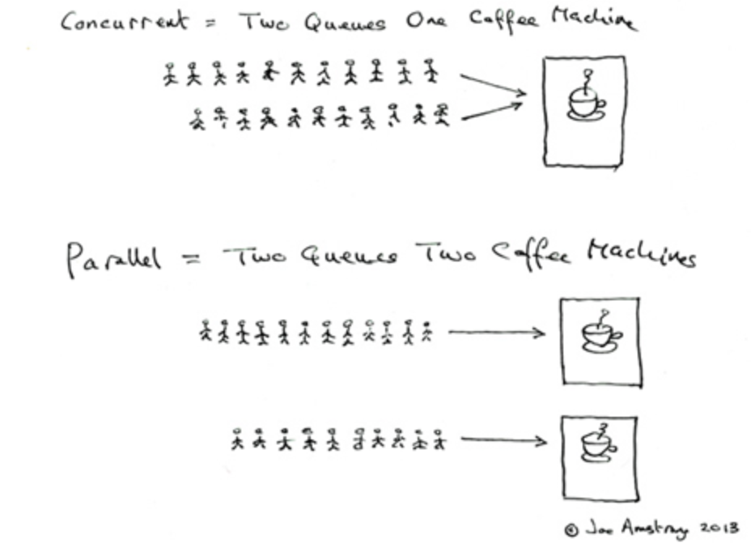

# 简介

- 并发：Concurrent
- 并行：Parallel



- Rust的线程模型是1:1
- 父线程结束后，子线程仍在持续运行，直到子线程的代码运行完成或者 `main` 线程的结束。

## 使用

例子1：创建线程

```rust
use std::thread;
use std::time::Duration;

fn main() {
    let handle = thread::spawn(|| {
        for i in 1..5 {
            println!("hi number {} from the spawned thread!", i);
            thread::sleep(Duration::from_millis(1));
        }
    });

    handle.join().unwrap();

    for i in 1..5 {
        println!("hi number {} from the main thread!", i);
        thread::sleep(Duration::from_millis(1));
    }
}
```

例子2：把外面的生命周期移进一个线程

```rust
use std::thread;

fn main() {
    let v = vec![1, 2, 3];

    let handle = thread::spawn(move || {
        println!("Here's a vector: {:?}", v);
    });

    handle.join().unwrap();

    // 下面代码会报错borrow of moved value: `v`
    // println!("{:?}",v);
}
```

例子3：线程屏障(Barrier)

```rust
use std::sync::{Arc, Barrier};
use std::thread;

fn main() {
    let mut handles = Vec::with_capacity(6);
    let barrier = Arc::new(Barrier::new(6));

    for _ in 0..6 {
        let b = barrier.clone();
        handles.push(thread::spawn(move|| {
            println!("before wait");
            b.wait();
            println!("after wait");
        }));
    }

    for handle in handles {
        handle.join().unwrap();
    }
}

// 输出：
before wait
before wait
before wait
before wait
before wait
before wait
after wait
after wait
after wait
after wait
after wait
after wait
```

## 特殊的

### 线程局部变量

例子1：

```rust
use std::cell::RefCell;
use std::thread;

thread_local!(static FOO: RefCell<u32> = RefCell::new(1));

FOO.with(|f| {
    assert_eq!(*f.borrow(), 1);
    *f.borrow_mut() = 2;
});

// 每个线程开始时都会拿到线程局部变量的FOO的初始值
let t = thread::spawn(move|| {
    FOO.with(|f| {
        assert_eq!(*f.borrow(), 1);
        *f.borrow_mut() = 3;
    });
});

// 等待线程完成
t.join().unwrap();

// 尽管子线程中修改为了3，我们在这里依然拥有main线程中的局部值：2
FOO.with(|f| {
    assert_eq!(*f.borrow(), 2);
});
```

例子2：

```rust
use std::cell::RefCell;

struct Foo;
impl Foo {
    thread_local! {
        static FOO: RefCell<usize> = RefCell::new(0);
    }
}

fn main() {
    Foo::FOO.with(|x| println!("{:?}", x));
}
```

### 使用条件控制线程的挂起和执行

1. `main` 线程首先进入 `while` 循环，调用 `wait` 方法挂起等待子线程的通知，并释放了锁 `started`
2. 子线程获取到锁，并将其修改为 `true`，然后调用条件变量的 `notify_one` 方法来通知主线程继续执行

```rust
use std::thread;
use std::sync::{Arc, Mutex, Condvar};

fn main() {
    let pair = Arc::new((Mutex::new(false), Condvar::new()));
    let pair2 = pair.clone();

    thread::spawn(move|| {
        let (lock, cvar) = &*pair2;
        let mut started = lock.lock().unwrap();
        println!("changing started");
        *started = true;
        cvar.notify_one();
    });

    let (lock, cvar) = &*pair;
    let mut started = lock.lock().unwrap();
    while !*started {
        started = cvar.wait(started).unwrap();
    }

    println!("started changed");
}
```

### 只被调用一次的函数

有时，我们会需要某个函数在多线程环境下只被调用一次，例如初始化全局变量，无论是哪个线程先调用函数来初始化，都会保证全局变量只会被初始化一次，随后的其它线程调用就会忽略该函数：

```rust
use std::thread;
use std::sync::Once;

static mut VAL: usize = 0;
static INIT: Once = Once::new();

fn main() {
    let handle1 = thread::spawn(move || {
        INIT.call_once(|| {
            unsafe {
                VAL = 1;
            }
        });
    });

    let handle2 = thread::spawn(move || {
        INIT.call_once(|| {
            unsafe {
                VAL = 2;
            }
        });
    });

    handle1.join().unwrap();
    handle2.join().unwrap();

    println!("{}", unsafe { VAL });
}
```


