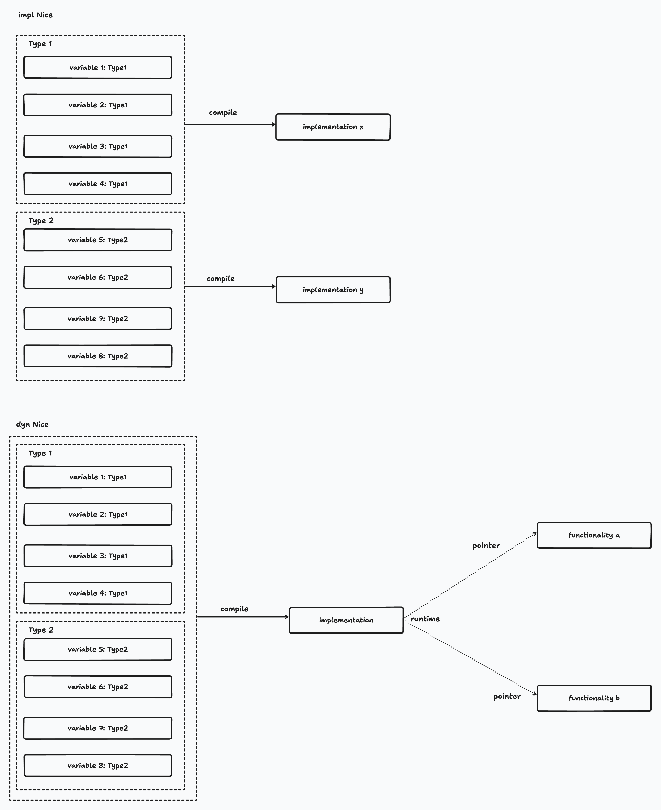

# impl和dyn的本质和区别

> 原视频：https://www.bilibili.com/video/BV1Bh411H7Kc/?spm_id_from=333.999.top_right_bar_window_custom_collection.content.click&vd_source=0cc0401ee122346d6680e90658b0ed1a

## 例子定义

```rust
trait Nice {
    fn nice(&self);
}

fn say_nice(n: impl Nice) {
    n.nice();
}

fn say_nice_dyn(n: &dyn Nice) {
    n.nice();
}

struct Hello {
    v: i32,
}

struct Good {
    v: i32,
}

impl Nice for Hello {
    fn nice(&self) {}
}

impl Nice for Good {
    fn nice(&self) {}
}
```

## demo1_impl

我们调用使用impl实现的`say_nice()`

```rust
fn main() {
    {
        let h = Hello { v: 30 };
        say_nice(h);

        let g = Good { v: 20 };
        say_nice(g);
    }
}
```

- 这时候，编译器生成的结果(可以自己在[网站](https://play.rust-lang.org/)尝试)为：生成了两个不同的`say_nice()`函数。

- 原因：当用不同的类型来调用`say_nice()`的时候，编译器会为每一个类型生成一个`say_nice()`函数。也就是说，impl会在编译的时候，为每一个类实现一个接口。

## demo2_impl

```rust
fn main() {
    {
        let h = Hello { v: 30 };
        say_nice(h);
     
        // let g = Good { v: 20 };
        // say_nice(g);
    }
}
```

- 这时候，编译器生成的结果为：生成了一个`say_nice()`函数。

- 原因：编译器生成代码之后，将代码插入到调用它的地方。由于`say_nice(g)`没有调用，因此不会生成。只为Hello实现了。

## demo3_dyn

```rust
fn main() {
    {
        let h = Hello { v: 30 };
        say_nice_dyn(&h);

        let g = Good { v: 20 };
        say_nice_dyn(&g);
    }
}
```

- 这时候，编译器生成的结果为：生成了一个`say_nice_dyn()`函数
- 原因：

```asm
playground::say_nice_dyn:
	subq	$24, %rsp
	movq	%rdi, 8(%rsp)
	movq	%rsi, 16(%rsp)
	callq	*24(%rsi)
	addq	$24, %rsp
	retq
```

main()中调用了两次`say_nice_dyn()`。可以将`L__unnamed_2`和`L__unnamed_3`视为函数指针，根据不同的函数指针，传入给`say_nice_dyn()`，从而实现不同的效果

```asm
playground::main:
	pushq	%rax
	movl	$30, (%rsp)
	movq	%rsp, %rdi
	leaq	.L__unnamed_2(%rip), %rsi
	callq	playground::say_nice_dyn
	movl	$20, 4(%rsp)
	leaq	4(%rsp), %rdi
	leaq	.L__unnamed_3(%rip), %rsi
	callq	playground::say_nice_dyn
	popq	%rax
	retq
```

看一下指针：分别指向了Hello和Good类

```asm
.L__unnamed_2:
	.asciz	"\000\000\000\000\000\000\000\000\004\000\000\000\000\000\000\000\004\000\000\000\000\000\000"
	.quad	<playground::Hello as playground::Nice>::nice

.L__unnamed_3:
	.asciz	"\000\000\000\000\000\000\000\000\004\000\000\000\000\000\000\000\004\000\000\000\000\000\000"
	.quad	<playground::Good as playground::Nice>::nice
```

因此，dyn是编译的时候，只为Nice trait实现一个函数，然后在runtime的时候根据不同的函数指针执行不同的行为

## demo4_impl_dyn

```rust
fn main() {
    {
        let h1 = Hello { v: 30 };
        say_nice(h1);
        let h2 = Hello { v: 30 };
        say_nice(h2);
        let h3 = Hello { v: 30 };
        say_nice(h3);
        let h4 = Hello { v: 30 };
        say_nice(h4);

        let g = Good { v: 20 };
        say_nice(g);
    }
    {
        let h = Hello { v: 30 };
        say_nice_dyn(&h);

        let g = Good { v: 20 };
        say_nice_dyn(&g);
    }
}
```

- 这时候，编译器生成的结果为：生成了两个`say_nice()`，生成了一个`say_nice_dyn()`函数
- 原因：

## 总结

- impl：在编译的时候，为不同的类型，实现不同的方法，且只实现一份
- dyn：在编译的时候，为一个trait实现一个方法，且只实现一份。不同的类型，会有不同的指针来在此份实现中得到不同的行为



其他：`&dyn`也可以用智能指针来替换，因为等效（在memory中有固定大小）。可以将impl理解为静态，dyn理解为动态。`&dyn`用于trait object，因为它大小不确定。


