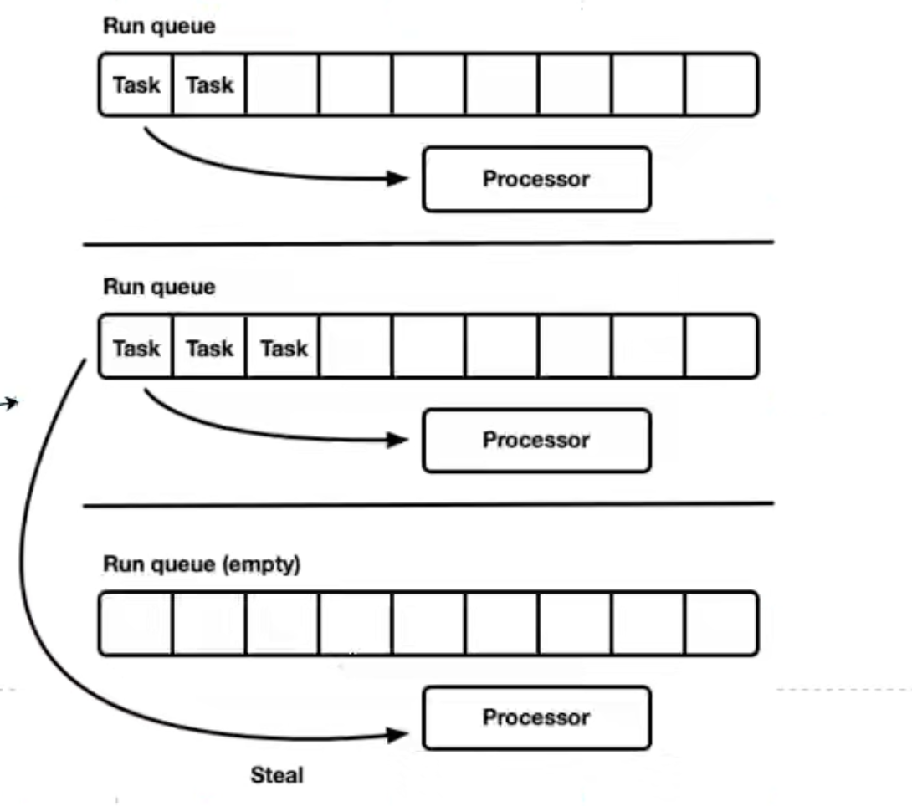

# async和await

> 笔记来自视频：https://www.bilibili.com/video/BV1CN411f7nF/?spm_id_from=333.999.0.0&vd_source=0cc0401ee122346d6680e90658b0ed1a 
>
> 笔记在代码中：code_02_async_await

- Steal: 各个队列的Processor可以相互抢任务，使得任务调度高效

