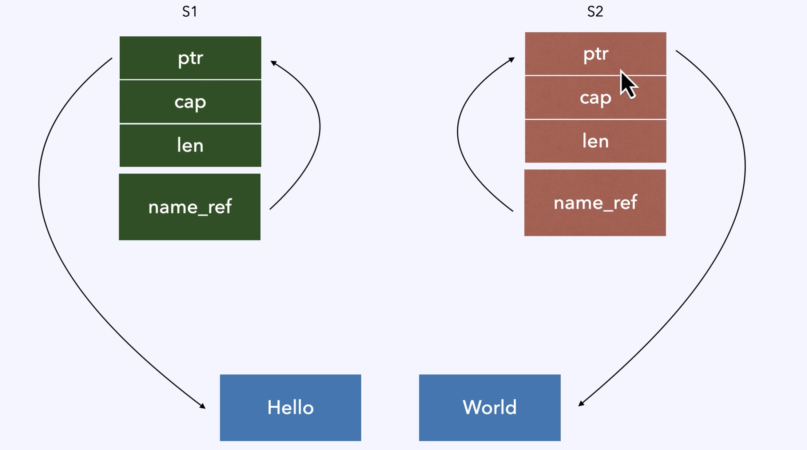
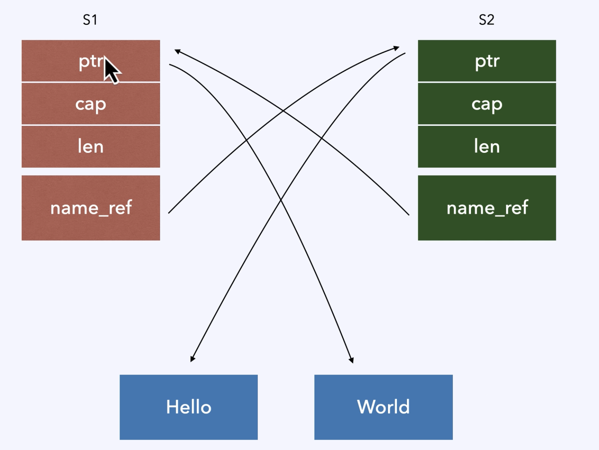

# Pin

> 原教程：https://www.bilibili.com/video/BV1nJzsYyE2B/?spm_id_from=333.1007.top_right_bar_window_dynamic.content.click&vd_source=0cc0401ee122346d6680e90658b0ed1a

## 简介

- 为什么要使用Pin？
  - 自引用结构
    - 可以有手工的自引用结构
    - async 生成的匿名Future也有可能是自引用结构
  - 自引用结构的内存不能被移动，否则将会带来安全问题
- Pin的语义
  - Pin住结构内存不被改变
  - `Pin<P<T>>`确保的是T被pin住，而不是P
    - 如 对于`<Pin<&mut T>`, pin住的是T，而不是`&mut T`
    - 如 对于`Pin<Box<T>>`，pin住的是T，而不是`Box<T>`
  - Unpin和!Unpin
    - Pin 和 Unpin不是一对，Unpin和!Unpin才是一对
      - 可以把Pin理解为动词
      - 可以把Unpin理解为形容词
    - `Pin<P<T>>`对于T：Unpin 不起作用，因为T是Unpinable，被Pin住也没有意义
- 核心：保护某块内存不可拿到可变引用，或者说某个结构体拿不到可变引用

## 理解

step1

 step2

